#### I. Accounts / Group
1. Accounts: Nơi tạo các tài khoản cho khách hàng. Cung cấp thông tin để tạo mã khách hàng ACCxxx.
- Chỉnh sửa thông tin, đổi mật khẩu, gửi link active - đổi mật khẩu, Khoá tài khoản, xoá tài khoản

2. Mã khách hàng: Nơi đổi chủ thể, Khoá, Chỉnh sửa tài nguyên, xoá mã KH

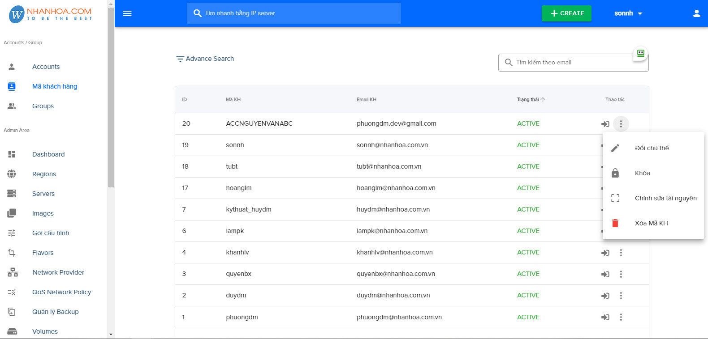 
- Chỉnh sửa tài nguyên:

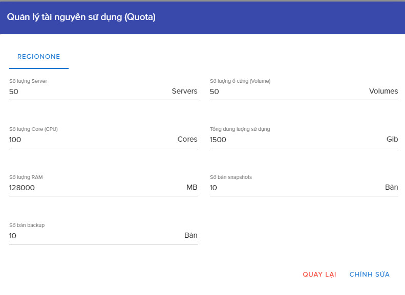

3. Group: Nơi quản trị nhóm, số lượng user và có thể thêm sửa xoá các quyền mà mỗi nhóm có thể sử dụng 

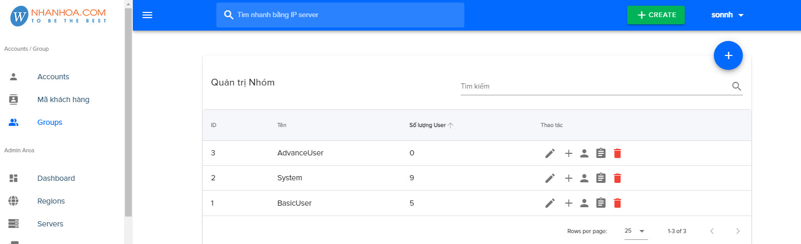

#### II. Admin Area
1. Dashboard: 

- Theo dõi trạng thái của máy chủ, tốc độ đọc và ghi trong các thiết bị lưu trữ (IOPS), số phần trăm và CPU, RAM đang sử dụng. Tổng số VM và compute
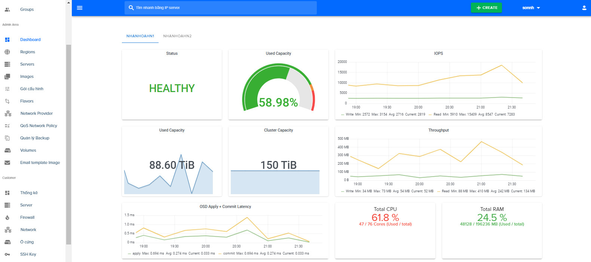
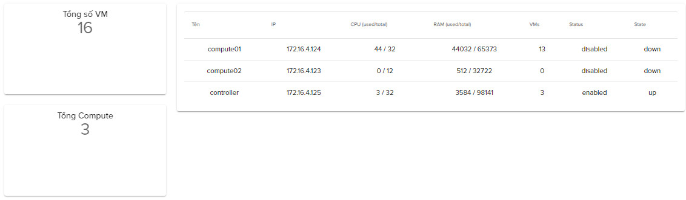

2. Server 
- Hiển thị số server đã được tạo và trạng thái của chúng. 
- Ngoài ra còn có thêm các chức năng console, Thông tin server , gia hạn, Stop, restart suspend, lock server, chức năng đồng bộ

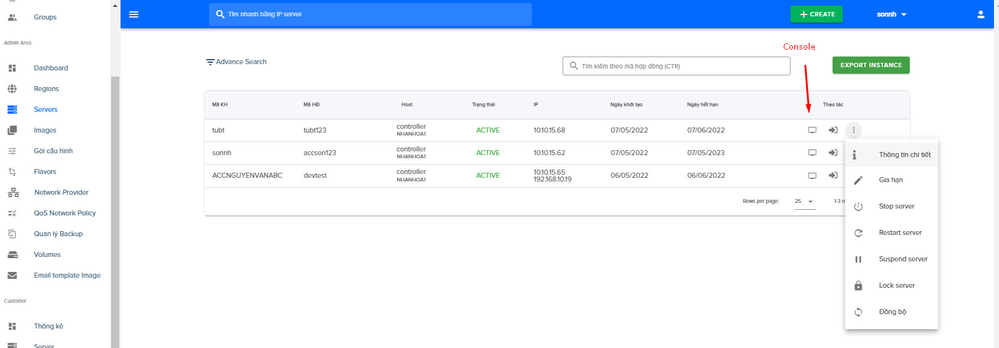

3. Images
Nơi chứa các images tạo sẵn, phục vụ cho việc cài đặt server 1 cách đơn giản, cùng với những phần mềm.

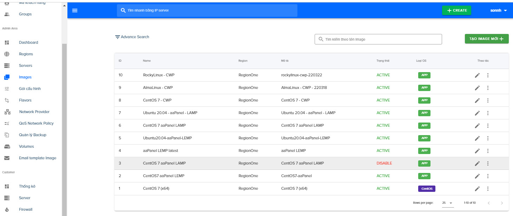

4. Các gói cấu hình 
Tạo các gói với các mức cố định, để quá trình tạo server dễ dàng hơn. 
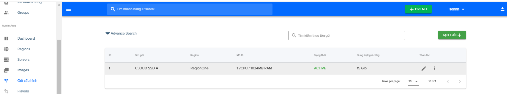

5. Flavors:
- openstack flavor: thiết lập thêm các gói với các mức RAM, CPU, dung lượng disk khác nhau. để phục vụ cho việc tạo thêm các gói cấu hình.

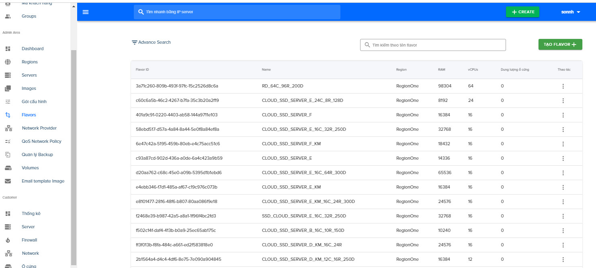

6. Network Provider
- Liệt kê các dải mạng đã được thiết lập
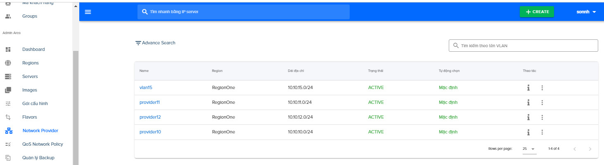

- Chúng ta có thể xem các thông tin dải mạng: 
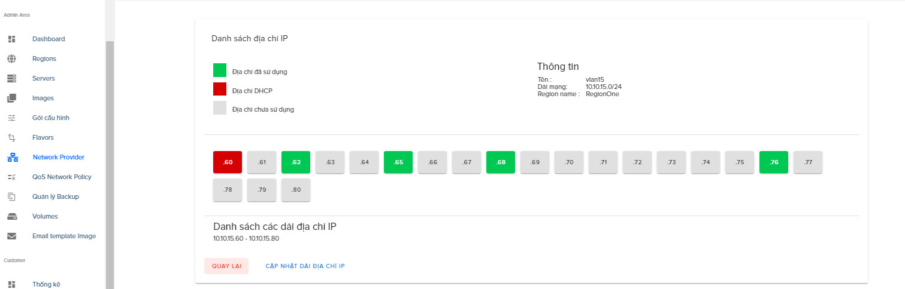

7. QoS Network Policy: Thêm và hiển thị các policy đã có. Thiết lập các policy cho mạng như giới hạn lưu lượng truy cập ở 1 mức nhất định nào đó

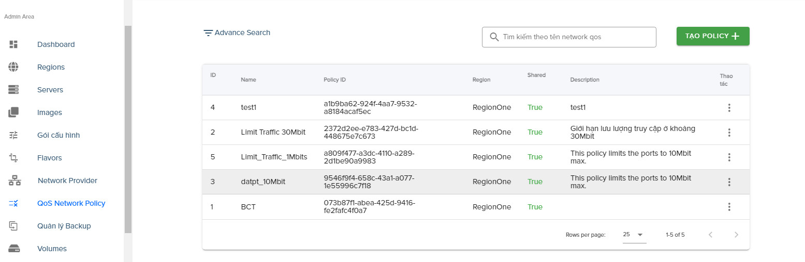

8. Quản lý Backup: Nơi thống kê, hiển thị các bản backup.
9. Volumes: Liệt kê các dung lượng đang sử dụng tại các máy server và trạng thái.
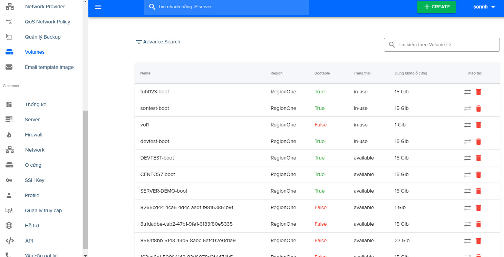
10. Email teamplate image: Các mẫu email đã soạn sẵn, sử dụng khi gửi thông tin cho khách hàng.
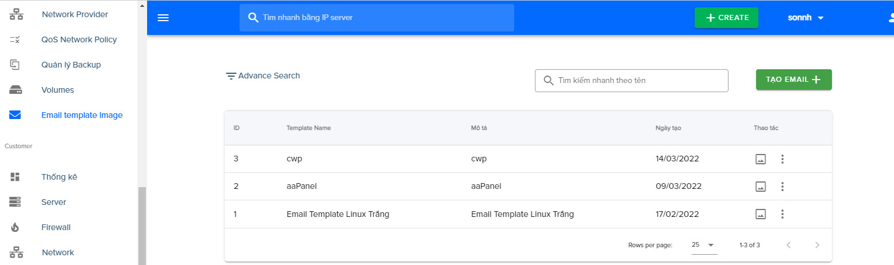

#### III.Customer

1. Thống kê: Số lượng server có thể tạo. Hiển thị RAM, CPU, ổ cứng và tổng dung lượng đang sử dụng
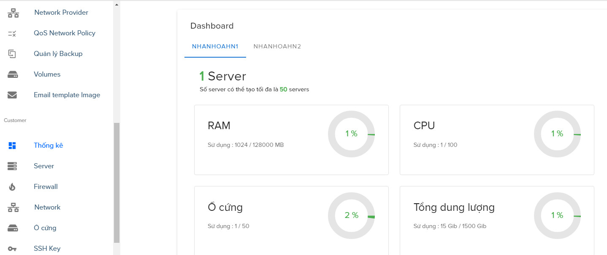

2. Server: Thống kê danh sách server tạo.
Bên cạnh đó còn có các chức năng để có thể thao tác với server: Stop, reboot, resize server (tính năng thay đổi cấu hình server CPU, RAM- lưu ý chỉ có thể tăng không giảm), Limit Traffic, Rebuild server, quản lý firewall, quản lý backup, Change password, Destroy server.

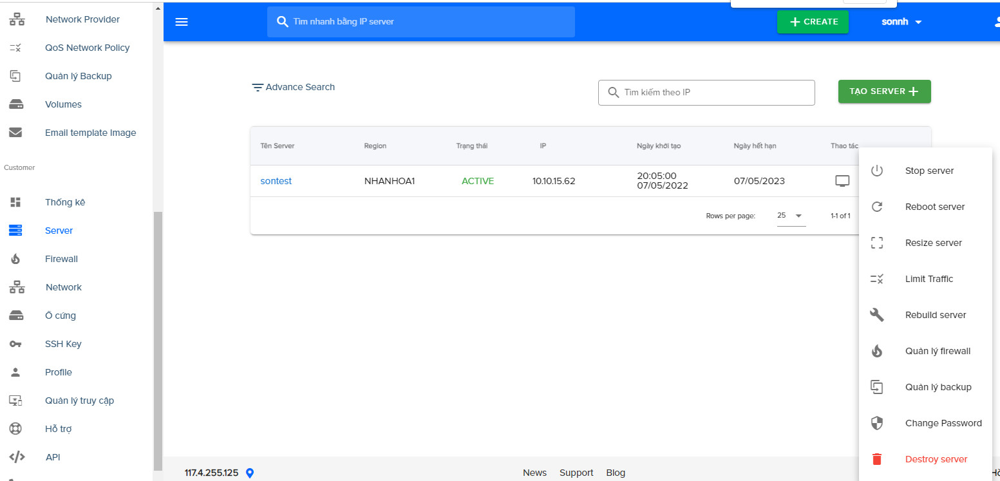

3. Firewall: Tạo firewall, thiết lập các rule. Áp dụng các server được chọn
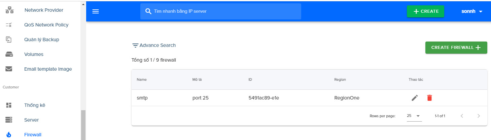
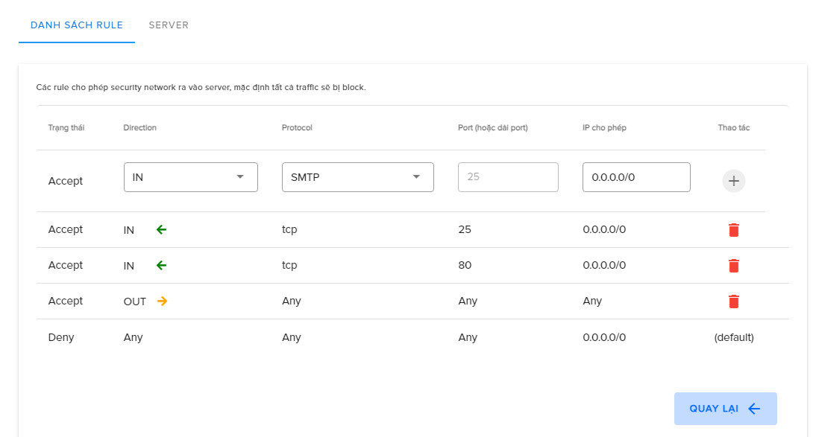

4. Network: Tạo network cùng với dải mạng
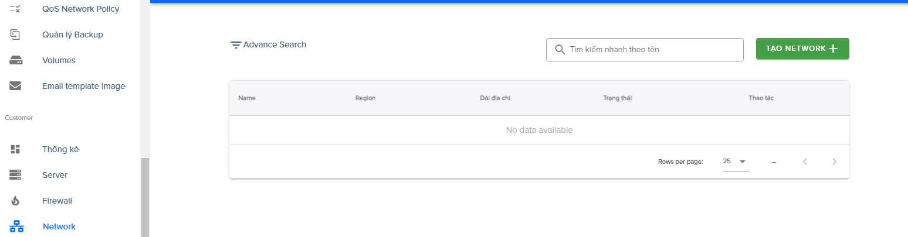

5. Ổ cứng: tạo thêm ổ cứng cho server và chỉnh sử dung lượng cho ổ cứng
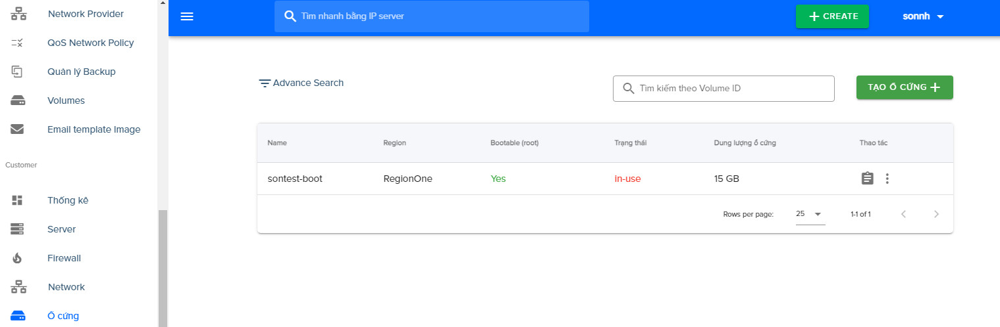

6. SSH Key: Login SSH bằng Key
7. Profile 
8. Quản lý truy cập: Xem được các thiết bị và ip đã truy cập vào server.

