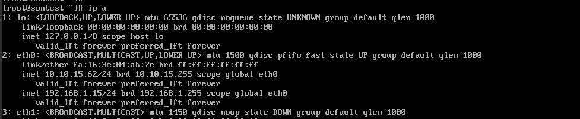

Ta chọn server ở mục quản lý network ta thêm ip public -> Chọn dải mạng muốn thêm

- Kiểm tra ip lúc chưa thêm 

- Trên giao diện quản lý ta thấy ip đã được thêm 

- SSH vào kiểm tra 

### Lưu ý
- Nếu khi thêm ip public sau đó ssh vào kiểm tra chưa thấy nhận thì ta phải cấu hình bằng tay trong mục 
``/etc/sysconfig/network-scripts/ifcfg-eth0``
- Sau đó khởi động lại netwwork

- Nếu thấy card mạng đang down, ta sử dụng lệnh ``ifup eth1``

- Sau đó tạo file ``ifcfg-eth1`` và cấu hình ( lưu ý đổi tên device và HWADDR) 

