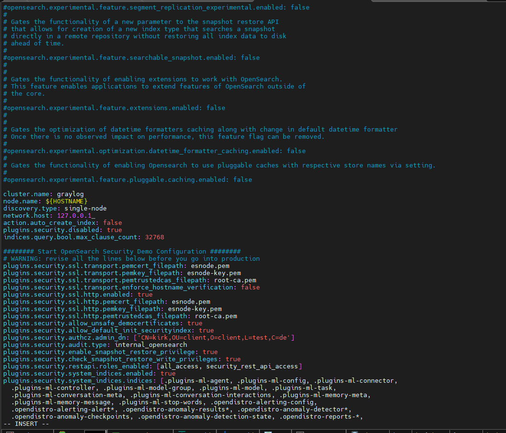

### 1. Giới thiệu

`Graylog` là một nền tảng quản lý log mã nguồn mở với nhiều tính năng mạnh mẽ. Có khả năng gộp và giải nén các dữ liệu quan trọng từ server log, thường sử dụng giao thức syslog. Hỗ trợ tìm kiếm và giúp hình dung cấu trúc của log qua giao diện web quản lý.

### 2. Thành phần:


- **MongoDB**: Lưu trữ các cấu hình và thông tin meta
- **Elasticsearch**: Lưu trữ log và cung cấp dữ liệu tìm kiếm, phần chiếm nhiều tài nguyên, các hành động phần lớn sẽ được thực hiện tại đây
- **Graylog** Phân tích cú pháp log và thu thập log từ các client gửi lên
- **GrayLog Web interface**: Quản lý bằng giao diện web

Các thành phần cùng với các phiên bản được GrayLog tương thích:


### 3. Cài đặt

```
OS: Ubuntu 20.04.5 LTS
Graylog 5.2
OpenJDK 17 (Cái này được nhúng trong Graylog và không cần cài đặt riêng)
OpenSearch 1.x, 2.x hoặc Elaticsearch 7.10.2
MongoDB 5.x hoặc 6.x
```

- Tắt firewall:

```
ufw stop
ufw disable
```

#### 3.1. Đồng bộ time

- Đồng bộ time với NTP server
    - Trên NTP server:
    


`systemctl restart chronyd`

- Trên graylog-server:

    - Cài đặt chrony để đồng bộ thời gian: `apt install chrony -y`
        - Cấu hình server đồng bộ: `vi /etc/chrony/chrony.conf`

        

        - Restart lại dịch vụ: `systemctl restart chronyd`


#### 3.2. Cài MongoDB

- Cài đặt gnupg:

```
sudo apt-get install gnupg curl
```

- Nhập khóa GPG công khai MongoDB

```
curl -fsSL https://www.mongodb.org/static/pgp/server-7.0.asc | \
   sudo gpg -o /usr/share/keyrings/mongodb-server-7.0.gpg \
   --dearmor
```

- Tạo tệp danh sách cho MongoDB:
    - Tạo file: `etc/apt/sources.list.d/mongodb-org-7.0.list` cho Ubuntu 20.04

```
echo "deb [ arch=amd64,arm64 signed-by=/usr/share/keyrings/mongodb-server-7.0.gpg ] https://repo.mongodb.org/apt/ubuntu focal/mongodb-org/7.0 multiverse" | sudo tee /etc/apt/sources.list.d/mongodb-org-7.0.list
```

- Reload the local package database:

```
sudo apt-get update
```

- Cài đặt MongoDB packages:

```
sudo apt-get install -y mongodb-org
```

- Truy xuất khóa GPG từ máy chủ khóa và thêm nó vào khóa cục bộ trong Ubuntu (để xác minh tính xác thực các packet)

```
wget -qO- 'http://keyserver.ubuntu.com/pks/lookup?op=get&search=0xf5679a222c647c87527c2f8cb00a0bd1e2c63c11' | sudo apt-key add -
```

- Enable, restart, status MongoDB

```
sudo systemctl daemon-reload
sudo systemctl enable mongod.service
sudo systemctl restart mongod.service
sudo systemctl --type=service --state=active | grep mongod
```


#### 3.3. Cài đặt OpenSearch

- Nếu bạn sử dụng OpenSearch làm data node thì hãy cài đặt các bước sau:

- Cài 1 số gói bổ sung: 

```
sudo apt -y install curl lsb-release gnupg2 ca-certificates
```

- Nhập khóa GPG công khai cho kho lưu trữ APT sẽ được thêm vào.

```
curl -fsSL https://artifacts.opensearch.org/publickeys/opensearch.pgp|sudo gpg --dearmor -o /etc/apt/trusted.gpg.d/opensearch.gpg
```

- Thêm kho lưu trữ APT cho OpenSearch:

```
echo "deb https://artifacts.opensearch.org/releases/bundle/opensearch/2.x/apt stable main" | sudo tee /etc/apt/sources.list.d/opensearch-2.x.list
sudo apt update
```

##### 3.3.1. Cài đặt và định cấu hình OpenSearch

- Nhập khóa GPG OpenSearch. Khóa này được sử dụng để xác thực chữ ký của các gói từ kho phần mềm OpenSearch.

```
curl -o- https://artifacts.opensearch.org/publickeys/opensearch.pgp | sudo gpg --dearmor --batch --yes -o /usr/share/keyrings/opensearch-keyring
```

- Tạo kho lưu trữ APT cho OpenSearch.

```
echo "deb [signed-by=/usr/share/keyrings/opensearch-keyring] https://artifacts.opensearch.org/releases/bundle/opensearch/2.x/apt stable main" | sudo tee /etc/apt/sources.list.d/opensearch-2.x.list
```

- Xác minh rằng kho lưu trữ đã được tạo thành công

```
sudo apt-get update
```

- Với thông tin kho lưu trữ đã được thêm vào, liệt kê tất cả các phiên bản OpenSearch có sẵn.

```
sudo apt list -a opensearch
sudo apt install opensearch
```

- Chọn phiên bản OpenSearch bạn muốn cài đặt. Trừ khi có chỉ định khác, phiên bản OpenSearch mới nhất hiện có đã được cài đặt. 
(Từ bản 2.12 trỏ lên yêu cầu `OPENSEARCH_INITIAL_ADMIN_PASSWORD` biến môi trường khi cài đặt, có thể check ở đây để đạt yêu cầu tối thiểu với [password](https://lowe.github.io/tryzxcvbn/))

- Download the desired Debian package.

```
curl -SLO https://artifacts.opensearch.org/releases/bundle/opensearch/2.13.0/opensearch-2.13.0-linux-x64.deb
```
        
- Biến môi trường khi cài đặt `OPENSEARCH_INITIAL_ADMIN_PASSWORD` 

```
sudo env OPENSEARCH_INITIAL_ADMIN_PASSWORD=Nhanhoa@01cd@#asf dpkg -i opensearch-2.13.0-linux-x64.deb
sudo systemctl daemon-reload
sudo systemctl enable opensearch.service
sudo systemctl start opensearch.service
sudo systemctl status opensearch.service
```


##### 3.3.2. Test OpenSearch

- Gửi yêu cầu đến máy chủ để xác minh rằng OpenSearch đang chạy. Lưu ý việc sử dụng ``--insecure``, điều này là bắt buộc vì chứng chỉ TLS được tự ký
    - Gửi request tới port 9200

    ```
    curl -X GET https://localhost:9200 -u 'admin:<custom-admin-password>' --insecure
    ```

    - Query the plugins endpoint:

    ```
    curl -X GET https://localhost:9200/_cat/plugins?v -u 'admin:<custom-admin-password>' --insecure
    ```


### 4. Cấu hình GrayLog cho OpenSearch

```
vi /etc/opensearch/opensearch.yml
```

- Cấu hình với tùy chọn single node:

```
cluster.name: graylog
node.name: ${HOSTNAME}
path.data: /var/lib/opensearch
path.logs: /var/log/opensearch
discovery.type: single-node
network.host: 0.0.0.0
action.auto_create_index: false
plugins.security.disabled: true
indices.query.bool.max_clause_count: 32768
```



- Để tạo multi-node Opensearch clusters hãy tham khảo thêm tại [đây](https://opensearch.org/docs/latest/tuning-your-cluster/cluster/)

- Enable JVM options: 

```
vi /etc/opensearch/jvm.options
```

- update Xms & Xmx settings bằng 1 nửa bộ nhớ của máy cài đặt Graylog:

```
-Xms4g
-Xmx4g
```


- Cấu hình các tham số kernel khi chạy:

```
sudo sysctl -w vm.max_map_count=262144
echo 'vm.max_map_count=262144' | sudo tee -a /etc/sysctl.conf
```

- Khởi động lại service

```
sudo systemctl daemon-reload
sudo systemctl enable opensearch.service
sudo systemctl start opensearch.service
sudo systemctl status opensearch.service
```


### 5. GrayLog

- Cài đặt kho lưu trữ Graylog Open và chính Graylog bằng các lệnh sau:

```
wget https://packages.graylog2.org/repo/packages/graylog-5.2-repository_latest.deb
sudo dpkg -i graylog-5.2-repository_latest.deb
sudo apt-get update && sudo apt-get install graylog-server 
sudo systemctl enable graylog-server.service
```


#### 5.1 File cấu hình

- Cần cấu hình tại file: `/etc/graylog/server/server.conf`

`Lưu ý:` cần thêm `password_secret` và `root_password_sha2` vào file cấu hình, nếu không Graylog sẽ không thể khởi động

- Tạo `password_secret`:

```
< /dev/urandom tr -dc A-Z-a-z-0-9 | head -c${1:-96};echo;
```

- Tạo `root_password_sha2` :

```
recho -n "Enter Password: " && head -1 </dev/stdin | tr -d '\n' | sha256sum | cut -d" " -f1
```


- Cấu hình Web Interface:

```
sudo sed -i 's/#http_bind_address = 127.0.0.1.*/http_bind_address = 172.16.5.70:9000/g' /etc/graylog/server/server.conf
```

- Truy cập file `/etc/graylog/server/server.conf` và điền 2 giá trị `password_secret` và `root_password_sha2` tương ứng


- Kiểm tra file log của graylog thấy được thông tin truy cập: `/var/log/graylog-server/server.log`


