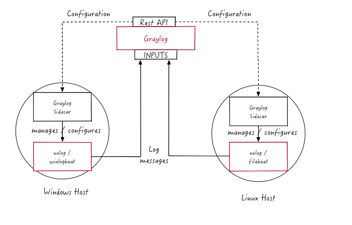
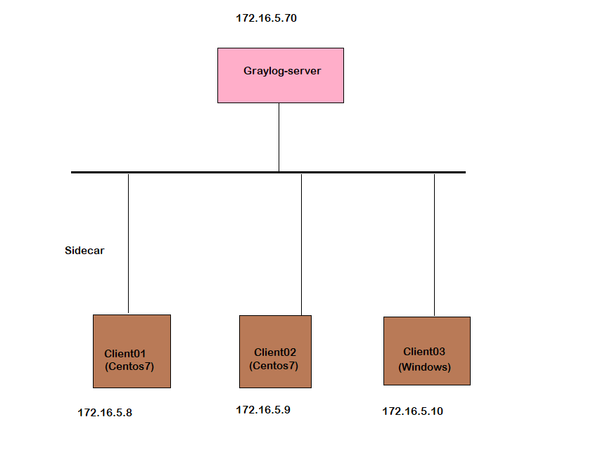

### Graylog Sidecar

Là 1 hệ thống quản lý giúp người dùng thu thập log. Nó quản lý các bộ thu thập log như Winlogbeat, Filebeat, NXLog

#### 1. Kiến trúc Sidecar

- Node Graylog là nơi tập trung chứa các log collector configurations. Sidecar daemon sẽ định kỳ tìm nạp tất cả các cấu hình có liên quan cho target bằng cách sử dụng REST API. Sidecar tạo các tệp cấu hình backend thích hợp trong lần đầu chạy hoặc khi thay đổi cấu hình. Sau đó sẽ start hoặc restart, các log collectors sẽ được cấu hình lại.

#### 2. Cấu hình Graylog Sidecar

