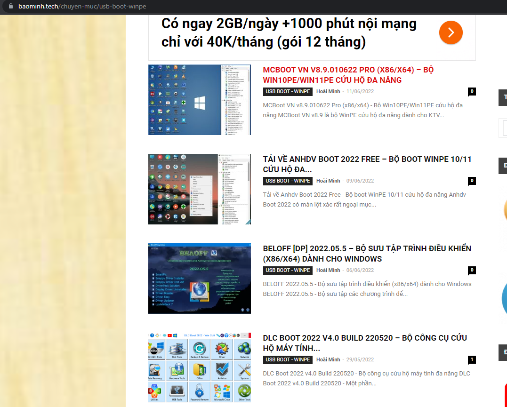
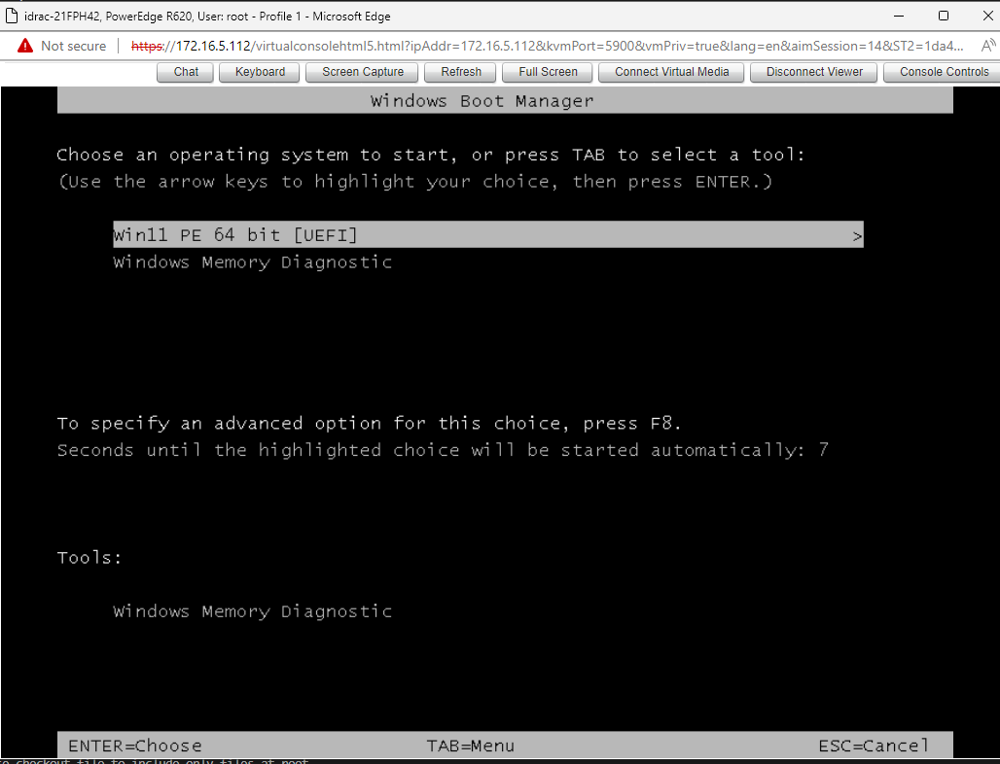
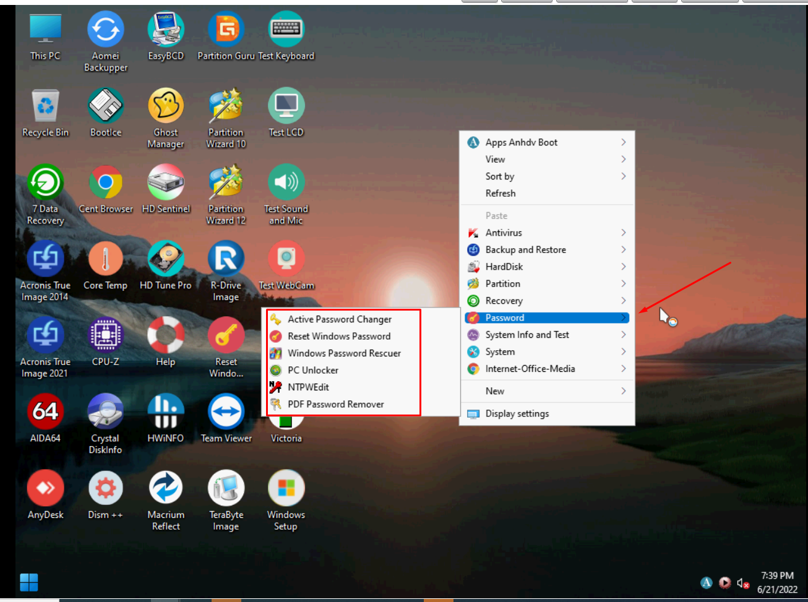
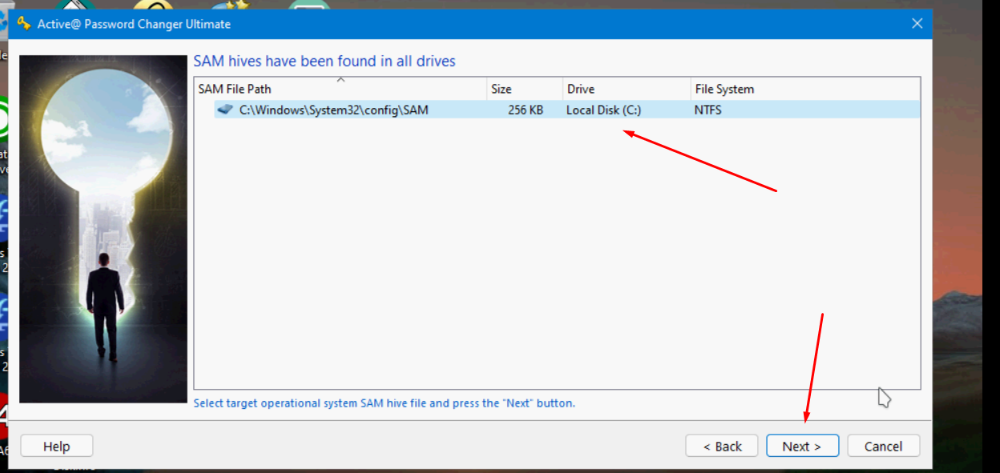
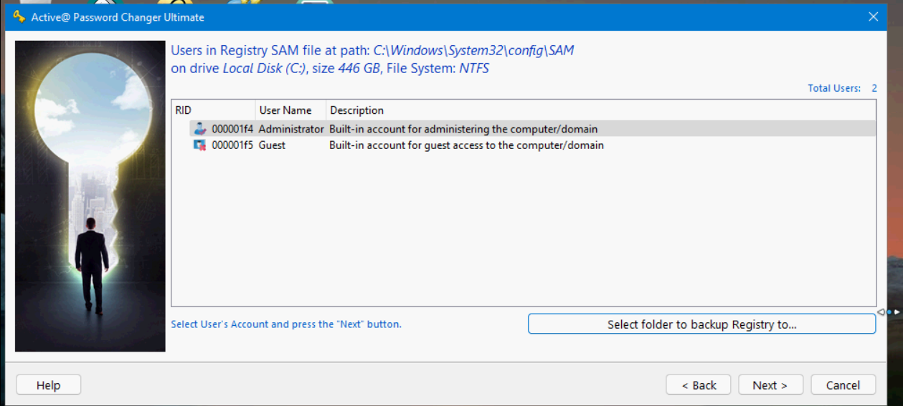
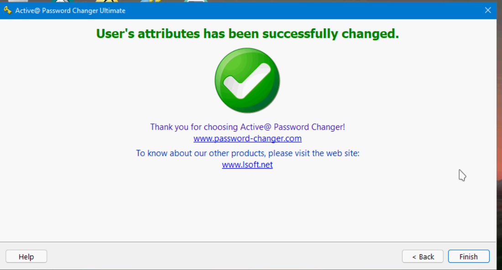
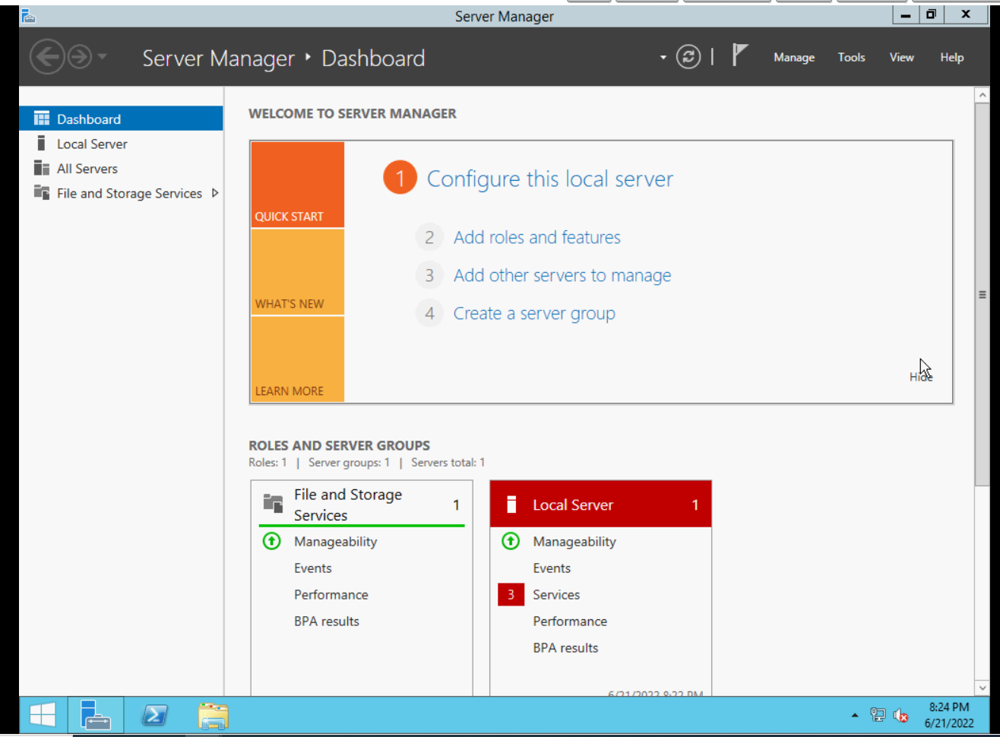

# Hướng dẫn reset pass trong windows 

### I. Change pass sử dụng usb boot

1. Sử dụng file iso.
- Ta sẽ tạo 1 usb boot từ file iso để sử dụng.
- Sau khi tạo usb, ta tiến hành cho server boot tới usb vừa tạo

- Trong giao diện đầu tiên, ấn Next.


4. Chọn `Repair your computer` để tiếp tục

5. chọn Troubleshoot, mục Advanced Options chọn Command Prompt để mở cửa sổ dòng lệnh.


- Cửa sổ cmd hiện ra:


6. Tại cửa sổ. Gõ lần lượt các lệnh

```
c:
cd windows\system32
ren Utilman.exe Utilman.exe.old
copy cmd.exe Utilman.exe
```


7. Tắt cửa sổ, chọn continue


8. Chờ server khởi động thành công. Ấn tổ hợp phím `Windows + U` để mở cửa sổ Command Prompt. Sau đó sử dụng lệnh: 
`net user administrator dc@123`

dc@123 là mật khẩu mới của tài khoản adminstrator


9. Đăng nhập thành công.


### II. Change pass sử dụng tool:

1. Sử dụng tool để reset pass:
- Ta có thể sử dụng cho mình các phần mềm cứu hộ như win PE: tạo USB BOOT - WINPE



- Ta có thể chọn cho mình 1 trong các bộ phần mềm ở phía trên, với rất nhiều các tính năng hỗ trợ, ở phần này ta chỉ làm về việc reset pass.

- Ở ví dụ này, sử dụng `Anhdv Boot 2022 Free`:
- Ta sẽ tải bản iso của Anhdv Boot 2022 sau đó tạo usb boot


- Tiến hành boot từ usb



- Sau khi boot vào ta được giao diện dưới đây và các tool sử dụng để reset pass:



- Dưới đây sẽ sử dụng `Active@ Password`


- Tiếp đó tool sẽ truy cập đến file SAM (nơi chứa cơ sở dữ liệu trong hệ điều hành windows có chứa tên người dùng và mật khẩu)



- Các user trên hệ thống sẽ được liệt kê ra. và ta sẽ chọn user cần đổi pass



- Sau đó ta chọn `Apply` để đổi pass và sẽ có 1 cảnh báo được đưa ra => `Yes`


- Thao tác thành công 



- Khởi động lại server ta sẽ login được với user đã chọn mà không cần pass.




### III. Change pass bằng cách sử dụng kvm ( đối với server vật lý)


