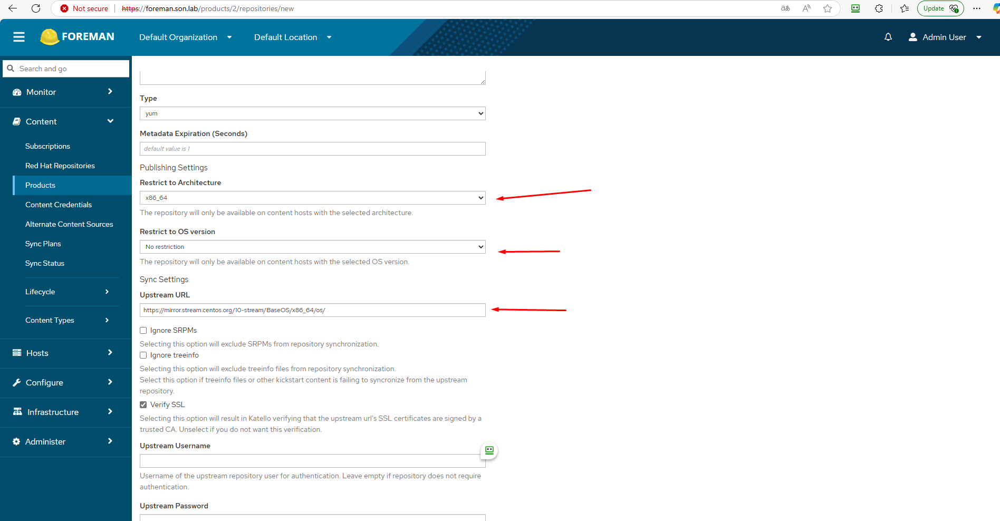
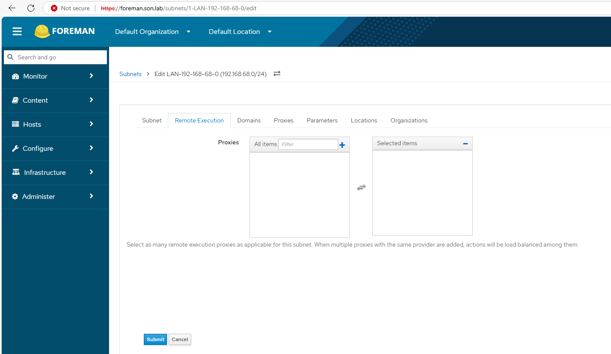
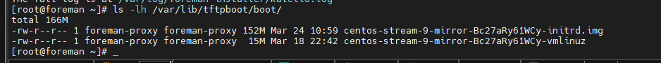
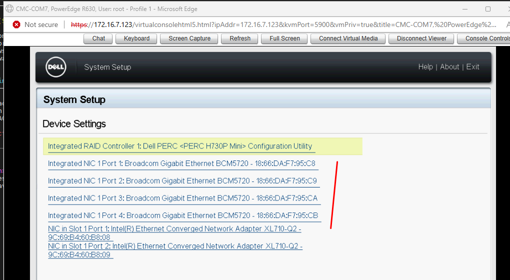

## I. Installing Foreman with Katello

- Đồng bộ time
- Tắt selinux
- Sửa hostname:
cat /etc/hosts
#127.0.0.1   localhost localhost.localdomain localhost4 localhost4.localdomain4
#::1         localhost localhost.localdomain localhost6 localhost6.localdomain6
172.16.9.39 foreman.son.lab

https://theforeman.org/plugins/katello/

```
[root@foreman ~]# rpm -q foreman
foreman-3.13.0-1.el9.noarch
```

https://docs.theforeman.org/3.13/Quickstart/index-katello.html

- Clear any metadata
dnf clean all

Install the foreman-release.rpm package:
dnf install https://yum.theforeman.org/releases/3.13/el9/x86_64/foreman-release.rpm

Install the katello-repos-latest.rpm package
dnf install https://yum.theforeman.org/katello/4.15/katello/el9/x86_64/katello-repos-latest.rpm -y

Install the puppet-release package
- For Puppet 8:
        dnf install https://yum.puppet.com/puppet8-release-el-9.noarch.rpm

Verify that the required repositories are enabled:
dnf repolist enabled


Installing Foreman server packages
Update all packages:
dnf upgrade

Install foreman-installer-katello
dnf install foreman-installer-katello -y

Running the Foreman installer
foreman-installer --scenario katello


```
  Success!
  * Foreman is running at https://foreman.son.lab
      Initial credentials are admin / QCDNpaWrDjp3omF6
  * To install an additional Foreman proxy on separate machine continue by running:

      foreman-proxy-certs-generate --foreman-proxy-fqdn "$FOREMAN_PROXY" --certs-tar "/root/$FOREMAN_PROXY-certs.tar.gz"
  * Foreman Proxy is running at https://foreman.son.lab:9090

The full log is at /var/log/foreman-installer/katello.log
```

-------------------

### I. Foreman sử dụng Smart Proxy để quản lý các dịch vụ như DHCP, DNS, và TFTP
1. File cấu hình Smart Proxy nằm tại: /etc/foreman-proxy/settings.yml
Đảm bảo cá dòng sau được bật
```
:http_port: 8000
:https_port: 9090
:bind_host: '192.168.68.39'  # Chỉ định Smart Proxy lắng nghe trên ens9
```


- Cấu hình module tại: `/etc/foreman-proxy/settings.d/`

1. DHCP: `/etc/foreman-proxy/settings.d/dhcp.yml`


```
:enabled: true
:use_provider: dhcp_isc
:server: 192.168.68.39
:subnets: ['192.168.68.0/24']
```

2. DNS: `/etc/foreman-proxy/settings.d/dns.yml`


```
:enabled: true
:use_provider: dns_nsupdate
:dns_server: 192.168.68.39
```

3. TFTP: `/etc/foreman-proxy/settings.d/tftp.yml`


```
:enabled: true
:tftproot: /var/lib/tftpboot
:tftp_servername: 192.168.68.39
```

4. Chạy lại foreman install để áp dụng với các dịch vụ mới:

```
foreman-installer --scenario katello \
                  --foreman-proxy-dhcp true \
                  --foreman-proxy-dhcp-managed true \
                  --foreman-proxy-dhcp-interface ens9 \
                  --foreman-proxy-dhcp-range "192.168.68.100 192.168.68.200" \
                  --foreman-proxy-dhcp-gateway "192.168.68.1" \
                  --foreman-proxy-dhcp-nameservers "192.168.68.39" \
                  --foreman-proxy-dns true \
                  --foreman-proxy-dns-managed true \
                  --foreman-proxy-dns-interface ens9 \
                  --foreman-proxy-dns-zone son.lab \
                  --foreman-proxy-dns-reverse 68.168.192.in-addr.arpa \
                  --foreman-proxy-tftp true \
                  --foreman-proxy-tftp-managed true
```

- `--foreman-proxy-dhcp-range`: Dải IP DHCP cấp phát (ví dụ: 192.168.68.100 - 192.168.68.200)
- `--foreman-proxy-dhcp-gateway`: IP của gateway trong mạng (thay đổi nếu khác 192.168.68.1)
- `--foreman-proxy-dhcp-nameservers`: DNS server
- `--foreman-proxy-dns-zone`: Tên miền
- `--foreman-proxy-dns-reverse`: Reverse DNS zone cho subnet


- kiểm tra trạng thái Smart Proxy: `systemctl status foreman-proxy`
`systemctl restart dhcpd`
`systemctl status tftp`
`systemctl enable --now tftp`

`chmod -R 755 /var/lib/tftpboot`

### II. Trên giao diện foreman

1. Content > Products > Create Products


- New Repository





- Các mục tiếp theo giữ nguyên, mục `Download Policy` có 2 tùy chọn: 
    - One Demand: có thể hiểu là tải từ các kho lưu trữ trên Internet để sử dụng khi có yêu cầu
    - Immediate: Tải về server, sẽ có dung lượng lớn, nên chọn tùy chọn này đối với các phiên bản os cũ


- Đợi chạy xong là được


2. Create Operating Systems


=> Submit


3. Creat Subnet





- Kiểm tra các dịch vụ trước khi cài OS


4. Khởi tạo host 


- Điền các thông tin, xác định địa chỉ MAC. Ở ví dụn này sử dụng vm trên KVM


=> Submit


- Có thể xem log cài đặt `/var/log/foreman-proxy/proxy.log`

Quá trình cài đặt đang diễn ra


`ls -lh /var/lib/tftpboot/boot/`



- Trên server vật lý thực hiện tương tự.
- Lấy MAC interface:




### IV. Console
1. Sử dụng Foreman Web Console (Built-in Terminal)
Foreman hỗ trợ tích hợp console qua giao diện web bằng plugin foreman_remote_execution hoặc foreman_console

- Thêm Puppet Repository
```
dnf install -y https://yum.puppet.com/puppet7-release-el-9.noarch.rpm
dnf clean all
dnf makecache
dnf install -y puppet-agent
```

2. Cấu hình Puppet để kết nối với Foreman
Sau khi cài đặt puppet-agent, cần cấu hình để host sv01 kết nối với Foreman server (foreman.son.lab) làm Puppet Master

- Trên foreman server cài : 
```
dnf install -y puppetserver
foreman-installer --scenario katello --enable-foreman-plugin-puppet
systemctl enable --now puppetserver                 # dùng port 8140
```


- Kiểm tra Puppetca: nếu chưa được bật hãy sửa thành `true`


- Chạy lại foreman-installer để kích hoạt Puppet

```
foreman-installer --scenario katello \
                  --enable-foreman-plugin-puppet \
                  --foreman-proxy-puppet true \
                  --foreman-proxy-puppetca true
```


- Trên host `sv01`: `/opt/puppetlabs/bin/puppet agent --test --server foreman.son.lab`


- Kiểm tra Infrastructure > Smart Proxies > foreman.son.lab


- Trên host `sv01` chạy lại: `/opt/puppetlabs/bin/puppet agent --test --server foreman.son.lab`


